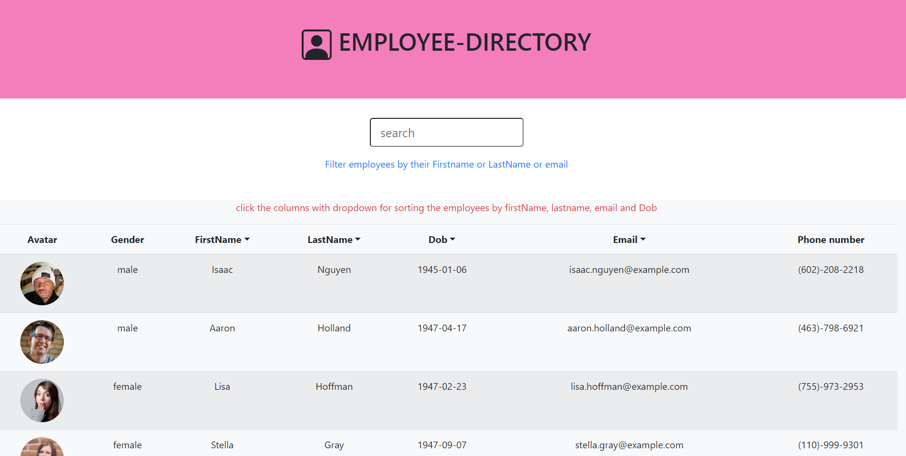
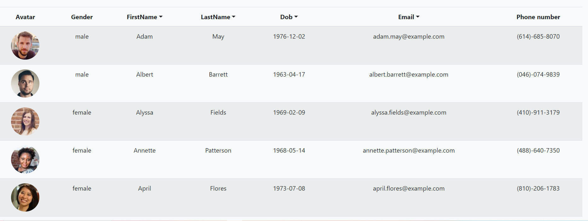
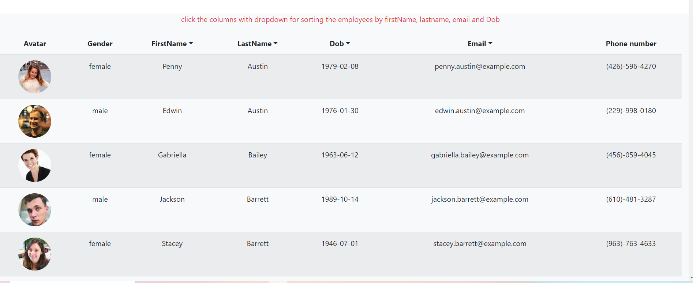
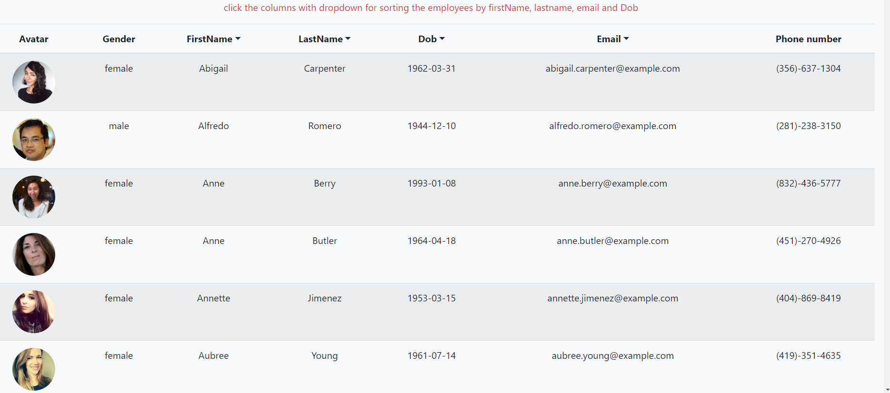
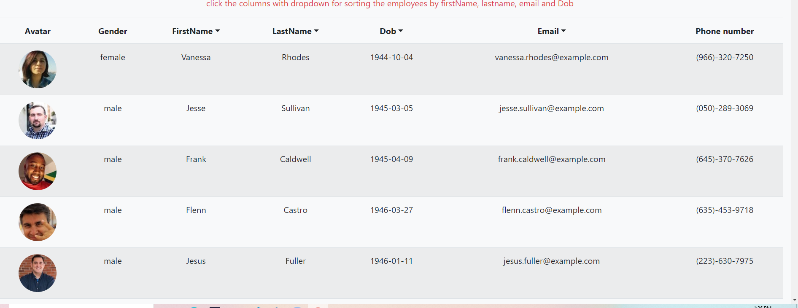
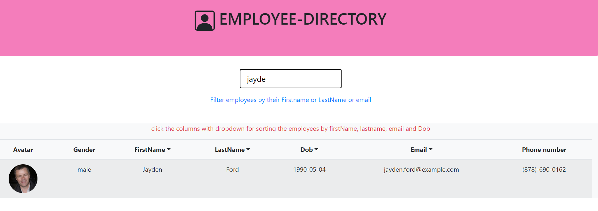

# Employee-Directory

## User Story

* As a user, I want to be able to view my entire employee directory at once so that I have quick access to their information.

## Business Context

An employee or manager would benefit greatly from being able to view non-sensitive data about other employees. It would be particularly helpful to be able to filter employees by name.

## Functional Description
The app fetches the employees profile once navigated to the app, it loads the table with employees image, firstname, lastname, email ,dob and phone number. The app fetches the random users from Random user Api.

## Features
 * The app allows the user to filter the employees by first name, last name, email and Dob
 * It also allows the user to sort the employees by name,email and dob in ascending order to fetch the info of a particular employee.

 ## Technologies Used
* React class components to manage state
* axios for making http calls
* bootstrap for styling
* Random user Api for getting user data
* svg icons
* gh-pages for deployment 

## Screenshots
the following screenshots will show the working features of the app

 sorted by first name

soreted by last name

sorted by email

sorted by dob

filter by name

please visit the deployed link on gh-pages [employee-directory](https://selvivini.github.io/user-directory/)